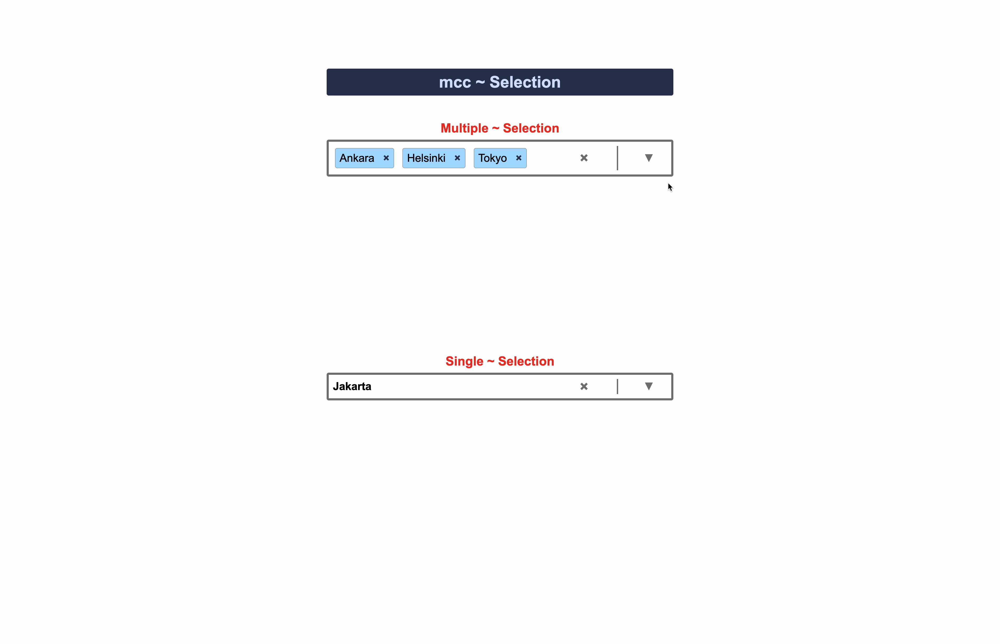

# Selection : Simple React App For Selecting Capitals

## Description

The Selection app is an excellent tool for practicing various fundamental and advanced concepts in React development. Here are some key benefits and learning opportunities it provides:

#### Button Activities
Event Handling: The app demonstrates how to handle button click events, which is essential for interactive web applications. By managing events such as selecting or clearing options, developers can understand the flow of user interactions and state changes.

Conditional Rendering: By using buttons to toggle between states (e.g., opening and closing the dropdown, selecting options), developers can learn how to render different UI elements conditionally based on the application's state.

#### Selecting Single or Multiple Choices
State Management: The app showcases state management for single and multiple selections. Developers can see how to manage complex states and update them based on user input.

Props and TypeScript: The use of TypeScript with props ensures type safety and helps in understanding the differences between single and multiple selections. This is crucial for building robust and maintainable applications.

Dynamic Rendering: The app dynamically renders the selected options, providing a practical example of how to display user-selected data in the UI.

#### Highlighting Issues
CSS Modules: The app uses CSS modules to handle styling, preventing class name conflicts. This is an important practice for maintaining scalable and maintainable styles in large applications.

User Feedback: By highlighting selected options and managing focus states, the app improves user experience by providing clear visual feedback on user actions.

#### Learning Outcomes
Event Handling and Conditional Rendering: Gain a solid understanding of handling user events and rendering UI elements conditionally.

State Management: Learn how to manage and update state for both single and multiple selections using React hooks.

Type Safety: Practice using TypeScript to enforce type safety and prevent common errors in prop handling.

Styling with CSS Modules: Master the use of CSS modules to avoid style conflicts and ensure consistent, maintainable styles.

By working with the Selection app, developers can build a strong foundation in React development, enhancing their skills in creating interactive, user-friendly, and maintainable web applications.
...

## Features

1. Features Used in the Selection App
The Selection app leverages several key features and best practices in React development to create a robust and interactive user interface. Below are the main features used:

2. React Hooks
useState: Utilized for managing state within the component, such as the highlighted index, the dropdown's open state, and the selected options.
useEffect: Employed to perform side effects, such as resetting the highlighted index when the dropdown opens.

3. TypeScript
Type Safety: The app uses TypeScript to define prop types and ensure type safety, preventing common errors and improving code maintainability.
Union Types: Used to handle different prop configurations for single and multiple selection modes.

4. Event Handling
onClick: Handlers are attached to various elements to manage user interactions, such as opening/closing the dropdown and selecting/clearing options.
onBlur: Used to close the dropdown when it loses focus.
onMouseEnter and onMouseLeave: Used for highlighting options when hovering over them.

5. Conditional Rendering
Dynamic Classes: Classes are conditionally applied to elements based on the component's state, such as showing the dropdown, highlighting options, and indicating selected options.
Ternary Operators: Used within JSX to render elements conditionally, providing a responsive and interactive UI.
CSS Modules
Scoped Styles: The app uses CSS modules to scope styles locally to the component, preventing class name conflicts and ensuring styles are maintainable.
Class Name Access: Hyphenated class names are accessed using square bracket notation, ensuring compatibility with CSS modules.
Array Methods
Array.prototype.map: Used to render the list of options dynamically based on the provided data.
Array.prototype.filter: Used to manage the selection state, particularly for multiple selections.
Key Features Overview
Multiple and Single Selection Modes: Supports both single and multiple selection configurations, allowing flexible usage.
Clear Selected Options: Provides a clear button to reset the selection.
Dynamic Highlighting: Highlights options on hover and indicates selected options for better user experience.
Dropdown Toggle: Toggles the visibility of the dropdown list based on user interaction.
Keyboard Accessibility: Implements focus and blur handlers to ensure the dropdown can be interacted with using the keyboard.

By exploring these features, developers can gain hands-on experience with core React concepts, event handling, state management, TypeScript, and CSS modules, making the Selection app a comprehensive learning tool.

## Gif

## Installation

1. Clone the repository: `git clone [repository URL]`

2. Navigate to the project directory: `cd [project directory]`

3. Install dependencies: `npm install`

## Usage

1. Start the development server: `npm run dev`

2. Open your browser and navigate to `http://localhost:5173/`

## Contributing

It is just a learning stuff, all type of contributions are well accepted.

## License

by mcc

## Contact

[]: # (<https://mcc1461.com/#home>)
